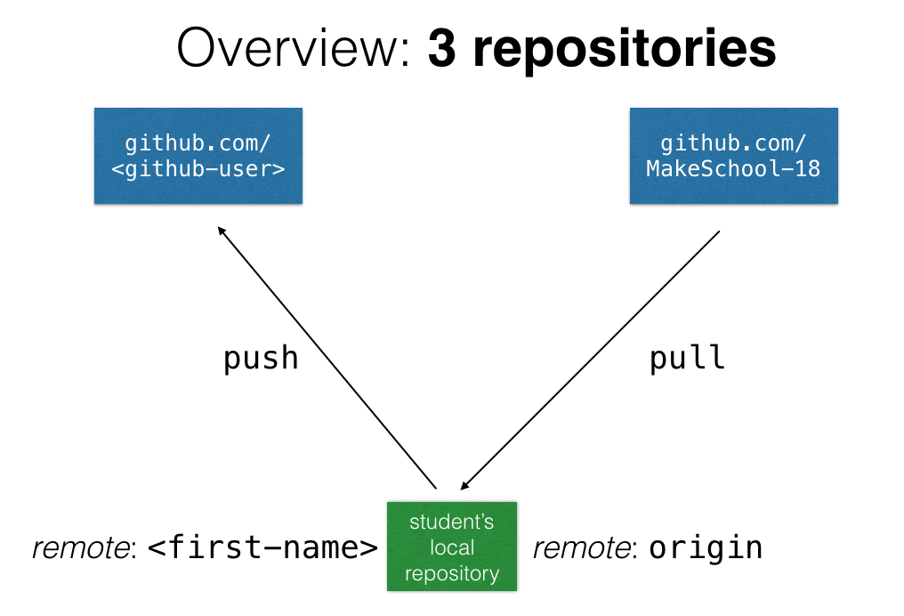

# Advanced Data Structures & Algorithms with Python

## Course Schedule

**Course Dates:** Monday, March 20 – Friday, May 12, 2017 (7 weeks)

**Class Times:** Monday, Wednesday, Friday 1–3pm (21 class sessions)

### [Class 1](Class1.md): Monday, March 20 – Number Bases

### [Class 2](Class2.md): Wednesday, March 22 – Recursion & Search Algorithms

### [Class 3](Class3.md): Friday, March 24 – String Algorithms

### [Class 4](Class4.md): Monday, March 27 – List, Array & Linked List

### [Class 5](Class5.md): Wednesday, March 29 – List, Stack & Queue

## Working with this GitHub repository

This repository (located at `https://github.com/MakeSchool-18/Data-Structures`) is the course's _origin_ repository which will contain course materials including links, slides, and challenges.
Note that you cannot commit or push to the origin repository.
However, you can _fork_ it to maintain your own version of it and push your code there. Here's an overview of what your repository setup should look like:

Follow these steps to set up your own course repository:

1. Clone this repository on your computer:
`git clone git@github.com:MakeSchool-18/Data-Structures.git`

2. Fork this repository on GitHub to create your own version of this repo on your GitHub account, which should also be named `Data-Structures`

3. Add your GitHub repository as a _remote_ to the local one on your computer (note: you need to give a name to the remote, e.g. your first name):
`git remote add <first-name> git@github.com:<github-user>/Data-Structures.git`

4. Link the local repo to your remote GitHub repo:
`git push -u <first-name> master`

5. When you want to access new course materials, just pull from the origin remote repo:
`git pull origin master`

6. When you've completed a challenge and want to share it for code review, commit your work and push it to your own remote repo with:
`git push`
